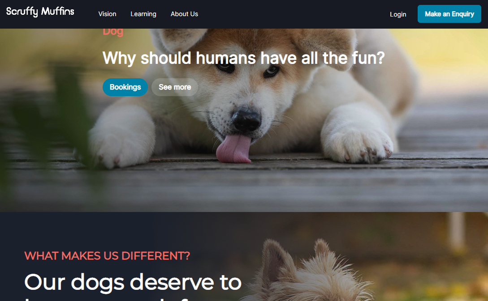

# Scruffy Muffins Doggy Daycare

## Description

This project is a MERN stack single-page application that works with real-world data and front end to simulate a working web application and makes use of the tools that would be used to create a full MERN stack application.

* React for the front end.

* GraphQL with a Node.js and Express.js server.

* MongoDB and the Mongoose ODM for the database.

* Queries and mutations for retrieving, adding, updating, and deleting data.

* Deployed using Heroku (with data).

* Have a polished UI.

* Be responsive.

* Be interactive (i.e., accept and respond to user input).

* Include authentication (JWT).

* Protect sensitive API key information on the server.

* Have a clean repository that meets quality coding standards (file structure, naming conventions, best practices for class and id naming conventions, indentation, high-quality comments, etc.).

* Have a high-quality README (with unique name, description, technologies used, screenshot, and link to deployed application).

The project is a webpage for a fictional dog day care centre that provides information about the business to customers and allows customers to send requests to the centre via the webpage to book their dogs into the day care centre. The day care centre staff can log in and view booking requests.

## Screenshot



## Required Packages

Install the required dependendcies with the following terminal command:
```sh
npm install
```

## Use

Users can view the application at the deployed webpage link.

After cloning the repository and installing the required npm packages, users can start the application locally with the folloiwng terminal commands:

```sh
npm run seed
npm run develop
```
To run the app locally, users will need an open instance of Mongodb running locally.

## License 
   
   None

## URLs
* [github.com/HuwRichmond/Booking-App](https://github.com/HuwRichmond/Booking-App)
* [afternoon-caverns-61979.herokuapp.com](https://afternoon-caverns-61979.herokuapp.com/)

## Contact

Created by Huw Richmond

[Github.com/HuwRichmond](https://github.com/HuwRichmond)

